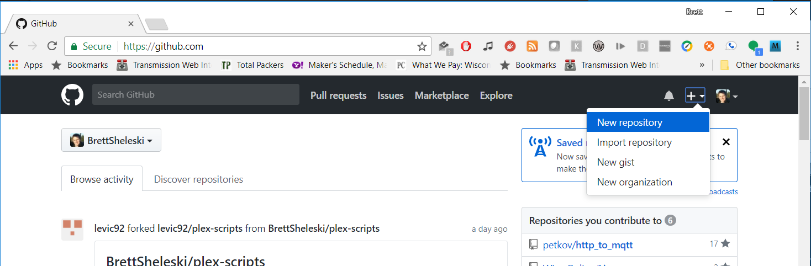

# Working in Windows
How to get a working Android emulator working with Visual Studio.

## On your Mac Virtual Machine

### Install Git
Go to https://git-scm.com/downloads and download the latest.  Install it once downloaded.

### Create new App in Visual Studio for Mac
Make sure to select add Git Repository.


Once done, make sure to commit all changes to your local Git repository.


After committing the changes, a "snapshot" will be created saving the current state of all tracked files to the local Git repository.


### Create GitHub Repository




Note the HTTPS URL for your Git Repository

Add your GitHub repository as a remote for your local Git repository.


Push your commits from your local Git repository to your GitHub repository.


Enter your GitHUb credentials


View all files on GitHub in browser.


## On Windows PC

### Install Git
Go to https://git-scm.com/downloads and download the latest.  Install it once downloaded.

### Install Android Studio
Once installed, open Android Studio.

This will download the Android SDK and most other required software.

Create a new project in Android Studio.  This actual project will not be needed, just click through the prompts to get to Android Studio.

Android Studio may display errors in the bottom that you may be missing necessary components.  Click the links it suggests to resolve any issues.

Open the Android SDK Manager


Make sure to have Android SDK Tools version 26 installed.


Create desired emulator by opening the Android AVD Manager


Click the Create Virtual Device button.


Choose your desired device definition.


Select the desired version of Android to be used.


(download if necessary)


Give your emulator a name


Start your emulator


### Install Visual Studio

Make sure to select Mobile App Development feature set during installation.


If this is not selected, you may modify your installation of Visual Studio by opening the Visual Studio 2017 Installer app.

### Open Visual Studio

Open Viual Studio


Go to the Team Explorer tab


Clone the GitHub Git repository


Once the clone operation completes, Visual Studio will open the cloned repository in the Solution Explorer tab.


Double click the solution file to open the solution (originally created by Visual Studio for Mac)


Choose the Android project as the Startup Project 


Choose the Emulator created by the AVD Manager


Start debugging.


Presto!

# Bonus

## View the iOS Simulator from Visual Studio (for Windows)

```
This process will only work while you are on campus at FVTC 
as the Mac Virtual Machines are not accessible via the internet.

If you have your own Mac on your home network, however, the same
process may be done at home.
```


### Enable SSH Connections to your Mac Virtual Machine
Open System Preferences for your Mac Virtual Machine


Select the Sharing icon


Enable the Remote Login service and allow the desired users.


You will need to know the Mac's IP address in order to connect to it.

In System Preferences


 click the Network icon.

 

 Note your Mac Virtual Machine's IP address (10.4.XXX.XXX)


### Connect to your Mac Virtual Machine from Visual Studio on PC

Open your project in Visual Studio (on PC).

Select the iOS project as your startup project.


Click the Simulator button to begin debugging.


Since you have not connected to your Mac Virtual Machine yet, Visual Studio will prompt you to enter your server information.


Click the `Add Server...` button and enter the IP address of your Mac Virtual Machine.


Enter your username and password to connect to the Mac Virtual Machine with


After Visual Studio connects to your Mac Virtual Machine you will see this.


You can now close this window.

Now in the debug toolbar, you will be able to choose any of the iOS Simulator hardware profiles your Mac Virtual Machine has installed.


After selecting your desired hardware/iOS version, you can click to start debugging.

If you watch your Mac Virtual Machine during this process, you will notice the iOS Simulator start and display your App.

Screenshot from Mac:


On the Windows PC, a screen displaying the iOS Simulator will also run.


Hooray!

It is important to realize that the actual app is running on the iOS Simulator on the Mac Virtual Machine, only the display is shown remotely on the Simulator running on the PC.

You may interact with the iOS Simulator on the PC.  Doing so will send any interactions to the Simulator running on the Mac and display the results.

## Making changes to app in Visual Studio (on PC) and using Git

You may make changes to the app in Visual Studio (on PC) and commit any changes to the Git repository on your PC.

