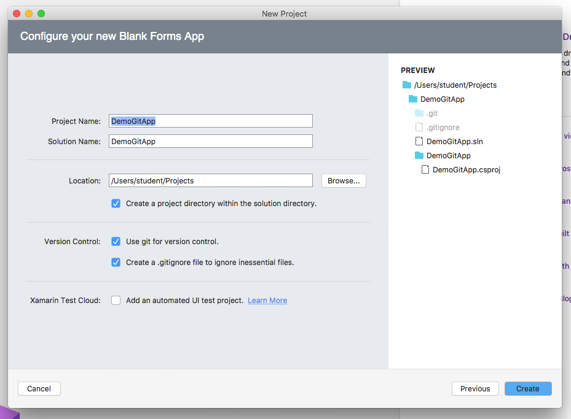

# Working in Windows
How to get a working Android emulator working with Visual Studio.

## On your Mac Virtual Machine

### Install Git
Go to https://git-scm.com/downloads and download the latest.  Install it once downloaded.

### Create new App in Visual Studio for Mac
Make sure to select add Git Repository.

Once done, make sure to commit all changes to your local Git repository.

After committing the changes, a "snapshot" will be created saving the current state of all tracked files to the local Git repository.

### Create GitHub Repository

Note the HTTPS URL for your Git Repository

Add your GitHub repository as a remote for your local Git repository.

Push your commits from your local Git repository to your GitHub repository.

Enter your GitHUb credentials

View all files on GitHub in browser.

## On Windows PC

### Install Git
Go to https://git-scm.com/downloads and download the latest.  Install it once downloaded.

### Install Android Studio
Once installed, open Android Studio.

This will download the Android SDK and most other required software.

Create a new project in Android Studio.  This actual project will not be needed, just click through the prompts to get to Android Studio.

### Install Visual Studio
Make sure to select Mobile App Development feature set during installation.

### Open Visual Studio
